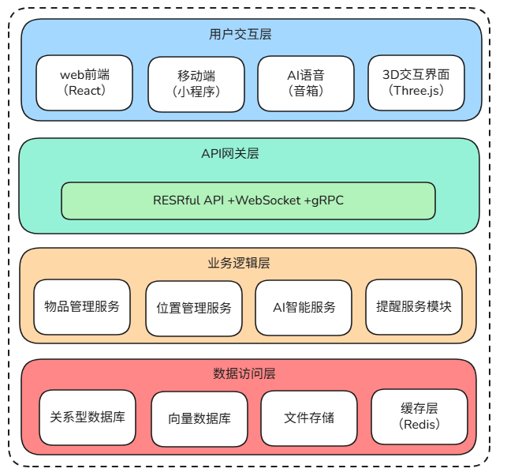

# NookVerse 系统架构文档

## 简介

NookVerse是一个将房子里所有物品，大到家具电器，小到柜子里的每一个物品，全部数字化存储并进行管理的系统，把"一屋之内自有乾坤"缩成四个字，听起来像一本家里的"魔法目录"，Nookverse 旨在通过数字化+智能化手段，彻底解决"家中物品找不到、记不清、管不好"的痛点，让每个家庭都能实现"一屋之内，自有乾坤"的智慧生活。

## 一、系统架构概览



## 二、功能点

### 核心管理功能

#### 1. 物品全生命周期管理
- 物品登记：添加、编辑、删除物品信息
- 属性管理：名称、分类、描述、价格、购买日期
- 多媒体关联：上传和管理图片、视频、文档
- 标签系统：为物品添加自定义标签，支持多标签分类
- 状态追踪：在用、闲置、丢弃、出借状态管理

#### 2. 空间层级管理
- 房屋管理：多套房屋/地址管理
- 房间管理：卧室、客厅、厨房等房间划分
- 位置层级：支持无限层级嵌套（房间→家具→抽屉→盒子→物品）
- 3D空间映射：与物理空间对应的虚拟映射

#### 3. 智能检索功能
- 快速搜索：按名称、标签、分类搜索
- 条件筛选：按位置、价格、购买时间、过期时间筛选
- 语义搜索：AI理解自然语言查询意图
- 位置检索：通过位置路径快速定位物品
- 高级搜索：组合多种条件精确查找

### 智能提醒功能

#### 4. 过期提醒系统
- 保质期提醒：食品、药品等过期前预警
- 保修期提醒：电子产品保修期提醒
- 维护提醒：家电、车辆定期维护提醒
- 续费提醒：会员、订阅服务续费提醒
- 自定义提醒：支持用户自定义任何时间节点提醒

#### 5. 智能通知
- 多通道通知：APP推送、短信、邮件、智能音箱语音提醒
- 分级提醒：紧急、重要、一般三级提醒
- 周期性提醒：每日、每周、每月定期统计提醒
- 汇总提醒：过期物品、即将过期物品汇总报告

### 多模态输入系统

#### 6. 便捷输入方式
- 手动输入：基础表单填写
- 条码扫描：扫描商品条码自动填充信息
- OCR识别：拍照识别商品信息
- 语音录入：语音转文字快速录入
- 批量导入：Excel/CSV模板批量导入
- AI自动识别：摄像头扫描自动识别物品
- 购物记录同步：电商平台订单自动导入

#### 7. 智能信息补全
- 商品库匹配：连接电商数据库自动补全信息
- 历史记录复用：相似物品信息自动填充
- AI信息提取：从图片中自动提取物品特征
- 社区共享模板：热门商品信息模板共享

### 3D可视化交互

#### 8. 空间可视化
- 房屋3D模型：真实房屋布局3D展示
- 物品定位：物品在3D空间中的位置标记
- 楼层切换：多层房屋楼层切换查看
- 视角控制：360度旋转、缩放、平移
- 平面图切换：3D与2D平面图模式切换

#### 9. 交互功能
- 点击查看：点击物品查看详细信息
- 拖拽移动：拖拽物品改变虚拟位置
- 搜索高亮：搜索时相关物品高亮显示
- 路径导航：从当前位置到目标物品的虚拟导航
- VR/AR支持：虚拟现实/增强现实查看

### AI智能助手

#### 10. 自然语言交互
- 语音问答："我的充电宝在哪里？"
- 智能推荐："推荐整理卧室的方法"
- 情境理解：理解"做饭用的工具"等模糊查询
- 多轮对话：复杂任务的多轮对话完成
- 多语言支持：中英文混合查询

#### 11. 智能分析建议
- 空间优化：建议更合理的物品摆放
- 购买建议：根据使用频率建议补货
- 断舍离建议：长期未用物品处理建议
- 统计报告：物品价值统计、分类占比分析
- 模式识别：识别用户使用习惯模式

### 多端协同功能

#### 12. 跨平台支持
- Web端：功能完整的管理后台
- 移动APP：iOS/Android原生应用
- 小程序：微信/支付宝轻量级应用
- 智能音箱：语音交互控制
- 智能家居：与智能家居设备联动

#### 13. 数据同步
- 实时同步：多端数据实时同步
- 离线支持：无网络时本地操作，联网后同步
- 冲突解决：多端修改冲突智能解决
- 备份恢复：云端备份和本地恢复

### 家庭共享协作

#### 14. 多用户管理
- 家庭成员管理：添加/移除家庭成员
- 权限分级：管理员、编辑者、查看者权限
- 个人空间：个人物品与公共物品区分
- 操作日志：所有操作记录追踪
- 消息通知：家庭成员间消息通知

#### 15. 协作功能
- 共享清单：购物清单、待办事项共享
- 物品借用：物品借用登记和归还提醒
- 任务分配：整理、清洁任务分配
- 批注评论：在物品上添加备注评论

### 数据分析报告

#### 16. 统计分析
- 物品统计：总数、分类统计、价值统计
- 使用分析：高频使用物品识别
- 消费分析：购物频率、金额分析
- 空间分析：各空间物品密度分析
- 趋势分析：物品增减趋势预测

#### 17. 报告生成
- 月度报告：每月物品变动报告
- 年度总结：年度使用情况总结
- 税务报告：可抵税物品价值报告
- 保险清单：保险理赔物品清单
- 搬家清单：搬家物品整理清单

### 扩展集成功能

#### 18. 第三方集成
- 电商平台：淘宝、京东购物记录导入
- 智能家居：与智能插座、摄像头联动
- 日历应用：与Google日历、Outlook同步提醒
- 地图应用：物品位置与地图集成
- 社交分享：整理成果社交平台分享

#### 19. 自动化流程
- IFTTT规则：自定义自动化规则
- 定时任务：定时生成报告、发送提醒
- 工作流：物品采购、登记、管理流程自动化
- API开放：开放API供开发者扩展

### 系统管理功能

#### 20. 系统配置
- 主题设置：浅色/深色主题切换
- 通知设置：各类通知方式个性化设置
- 数据管理：数据导入/导出/备份/恢复
- 隐私设置：数据隐私权限管理
- 多语言：支持中英文界面切换

## 功能亮点总结

| 类别 | 核心功能 | 价值主张 |
|------|---------|---------|
| **智能管理** | AI物品识别、智能分类、语义搜索 | 让物品管理变得简单智能 |
| **空间可视化** | 3D房屋模型、物品精确定位 | 所见即所得的物品定位 |
| **全周期提醒** | 过期预警、维护提醒、续费提醒 | 让生活更加从容有序 |
| **便捷输入** | 扫码、拍照、语音、批量导入 | 极大降低录入成本 |
| **家庭协作** | 多用户共享、权限管理、消息通知 | 全家人的物品管家 |
| **数据分析** | 统计报告、使用分析、趋势预测 | 数据驱动的智能决策 |
| **跨平台** | Web+APP+小程序+智能音箱 | 随时随地管理家中物品 |

## 三、技术栈

### 后端技术栈
- 开发语言: Go 1.25+
- Web框架: Echo（轻量级高性能）
- ORM框架: GORM（数据库操作）
- 消息队列: RabbitMQ（用于异步任务，如AI处理）
- 缓存: Redis
- 任务调度: cron

### 前端技术栈
- 主框架: React 18 + TypeScript
- UI库: Ant Design
- 状态管理: Redux Toolkit
- 3D引擎: Three.js + React Three Fiber
- 开发工具: VS Code
- 构建工具: Vite

### 数据库推荐
1. 主数据库: PostgreSQL
   - 支持JSONB，适合存储物品的扩展属性
   - 强大的全文搜索功能
   - 良好的空间数据处理（未来可用于3D坐标）
2. 向量数据库: Weaviate
   - 用于AI语义搜索
   - 物品描述的特征向量存储
3. 文件存储: MinIO（自建对象存储）
   - 存储物品图片、视频

## 四、数据库设计扩展

```sql
-- 1. 房屋表
CREATE TABLE houses (
  id UUID PRIMARY KEY DEFAULT gen_random_uuid(),
  name VARCHAR(100) NOT NULL,
  address TEXT,
  created_at TIMESTAMP DEFAULT NOW(),
  updated_at TIMESTAMP DEFAULT NOW(),
  metadata JSONB -- 存储房屋3D模型路径等信息
);

-- 2. 房间表
CREATE TABLE rooms (
  id UUID PRIMARY KEY DEFAULT gen_random_uuid(),
  house_id UUID REFERENCES houses(id) ON DELETE CASCADE,
  name VARCHAR(100) NOT NULL,
  room_type VARCHAR(50), -- 卧室、客厅等
  position_data JSONB, -- 3D坐标和边界信息
  created_at TIMESTAMP DEFAULT NOW(),
  updated_at TIMESTAMP DEFAULT NOW()
);

-- 3. 物品表（核心）
CREATE TABLE items (
  id UUID PRIMARY KEY DEFAULT gen_random_uuid(),
  name VARCHAR(200) NOT NULL,
  description TEXT,
  category_id UUID REFERENCES categories(id),
  room_id UUID REFERENCES rooms(id) ON DELETE SET NULL,
  container_id UUID REFERENCES items(id) ON DELETE SET NULL, -- 解决包含关系
  quantity INTEGER DEFAULT 1,
  status VARCHAR(20) DEFAULT 'active', -- active, archived, discarded

  -- 重要属性
  expire_date DATE,
  purchase_date DATE,
  price DECIMAL(10,2),
  warranty_period INTEGER, -- 保修期（月）
  
  -- 位置详情
  position JSONB, -- 相对位置（x,y,z坐标或描述性位置）
  custom_position TEXT, -- 用户自定义位置描述
  
  -- 扩展属性
  attributes JSONB, -- 存储品牌、型号、颜色等
  labels TEXT[], -- 标签数组
  
  created_at TIMESTAMP DEFAULT NOW(),
  updated_at TIMESTAMP DEFAULT NOW(),
  
  -- 索引
  INDEX idx_items_room (room_id),
  INDEX idx_items_container (container_id),
  INDEX idx_items_expire (expire_date),
  INDEX idx_items_labels (labels)
);

-- 4. 分类表
CREATE TABLE categories (
  id UUID PRIMARY KEY DEFAULT gen_random_uuid(),
  name VARCHAR(100) NOT NULL,
  parent_id UUID REFERENCES categories(id), -- 支持分类层级
  icon VARCHAR(50),
  color VARCHAR(20),
  created_at TIMESTAMP DEFAULT NOW()
);

-- 5. 媒体文件表
CREATE TABLE media_files (
  id UUID PRIMARY KEY DEFAULT gen_random_uuid(),
  item_id UUID REFERENCES items(id) ON DELETE CASCADE,
  file_url TEXT NOT NULL,
  file_type VARCHAR(20), -- image, video, document
  thumbnail_url TEXT,
  created_at TIMESTAMP DEFAULT NOW()
);

-- 6. 提醒表
CREATE TABLE reminders (
  id UUID PRIMARY KEY DEFAULT gen_random_uuid(),
  item_id UUID REFERENCES items(id) ON DELETE CASCADE,
  reminder_type VARCHAR(20), -- expire, maintenance, etc.
  trigger_time TIMESTAMP NOT NULL,
  message TEXT,
  status VARCHAR(20) DEFAULT 'pending',
  created_at TIMESTAMP DEFAULT NOW()
);
```

## 五、核心模块设计

### 1. 物品层级管理
```go
// 物品位置解析器
type ItemLocator struct {
  // 解析物品的完整位置路径
  // 如：房屋/主卧/衣柜/抽屉/电池
  GetFullLocation(itemID string) (string, error)

  // 查找某位置下的所有物品
  GetItemsInLocation(locationPath string) ([]Item, error)
}

// 使用闭包表存储层级关系
CREATE TABLE item_hierarchy (
  ancestor_id UUID REFERENCES items(id),
  descendant_id UUID REFERENCES items(id),
  depth INTEGER,
  PRIMARY KEY (ancestor_id, descendant_id)
);
```

### 2. 快速输入方案
```go
// 多种输入方式整合
type ItemImporter interface {
  // 1. 二维码/条形码扫描
  ScanBarcode(barcode string) (ItemInfo, error)

  // 2. OCR图片识别
  RecognizeFromImage(image []byte) (ItemInfo, error)

  // 3. AI语音输入
  ProcessVoiceCommand(command string) (ItemAction, error)

  // 4. 批量导入模板
  BatchImportFromTemplate(file []byte) error
}
```

### 3. 3D交互实现
```javascript
// Three.js + React Three Fiber组件
const House3DViewer = ({ houseId }) => {
  const { scene, camera, gl } = useThree();

  // 加载房屋3D模型
  useLoader(GLTFLoader, `/models/house-${houseId}.glb`, (gltf) => {
    // 渲染房间和物品
    renderRoomsAndItems(gltf.scene);
  });

  // 点击物品交互
  const handleItemClick = (itemId) => {
    // 显示物品详情
    showItemDetails(itemId);
  };

  return (
    <Canvas>
      <OrbitControls />
      <ambientLight intensity={0.5} />
      {rooms.map(room => (
        <Room3D key={room.id} room={room} />
      ))}
    </Canvas>
  );
};
```

## 六、AI智能模块架构

```go
// AI Agent服务
type AIAgent struct {
  llmClient    *LLMClient     // 大语言模型客户端
  vectorDB     *VectorDB      // 向量数据库
  knowledgeBase *KnowledgeBase // 物品知识库
}

func (a *AIAgent) HandleQuery(query string, context QueryContext) Response {
  // 1. 语义理解
  intent := a.UnderstandIntent(query)

  // 2. 上下文检索
  relatedItems := a.SearchSimilarItems(query)
  
  // 3. 生成回答或操作
  if intent == "find_item" {
    return a.FindItemProcess(query, relatedItems)
  } else if intent == "add_item" {
    return a.AddItemProcess(query, context)
  }
  // ... 其他意图处理
}

// 智能提醒系统
type SmartReminder struct {
  CheckExpiringItems() []Reminder
  SuggestReorganization() []Suggestion
  PredictRestocking() []Prediction
}
```

## 七、部署架构

Docker容器化部署

## 八、开发路线图

### 第一阶段（MVP - 2-3个月）
1. 基础CRUD功能实现
2. 简单的物品分类和搜索
3. 基础Web界面
4. 手机端适配

### 第二阶段（增强版 - 3-4个月）
1. 物品层级关系管理
2. 图片上传和识别
3. 过期提醒功能
4. 基础3D视图

### 第三阶段（AI智能化 - 4-6个月）
1. AI智能对话接口
2. 智能分类和标签
3. 高级搜索和推荐
4. 智能提醒优化

## 九、关键技术挑战解决方案

1. 物品包含关系：使用闭包表+物化路径
2. 3D定位：相对坐标系+层级变换
3. 快速输入：多模态输入+预填充模板
4. 智能搜索：Elasticsearch+向量检索混合
5. 性能优化：CDN静态资源+Redis缓存+数据库索引